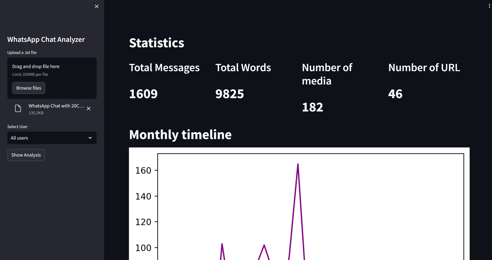
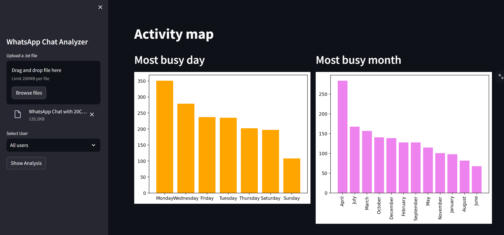
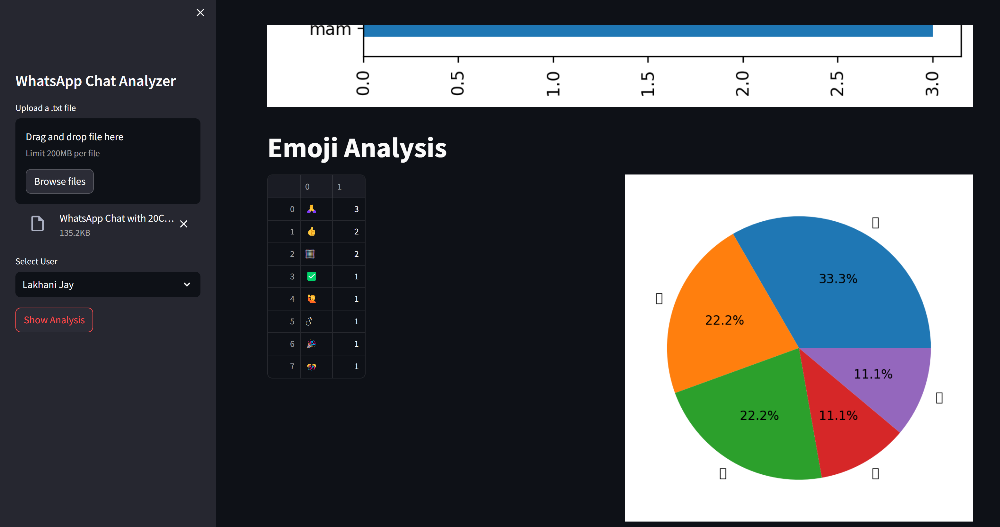

# **Project: Whatsapp Chat Analyzer**
## Overview
The aim of this project is to develop a robust WhatsApp chat statistics analysis tool. Leveraging exported WhatsApp chat files, the tool generates insightful graphs and visualizations.

## Introduction
The "WhatsApp Chat Analyzer" project, detailed in this technical paper, converges at the crossroads of data science, natural language processing, and information retrieval. Its primary objective is to unlock the potential within WhatsApp conversations. These exchanges harbor a treasure trove of information, encompassing individual sentiments, social dynamics, emerging trends, security vulnerabilities, and knowledge sharing. Our project serves as a comprehensive toolkit, unraveling and elucidating the intricacies embedded in these chats.

## Project Tools
- Python: Python, a dynamic and high-level programming language, stands as the undisputed choice for data analysis.
- Jupyter Notebook: A popular interactive computing environment enabling the creation and sharing of documents containing live code, equations, visualizations, and narrative text.
- Amazon EC2: A widely used web service by Amazon Web Services (AWS) that offers resizable compute capacity in the cloud.
- GitHub: A web-based platform and service facilitating version control and collaborative software development.
- Matplotlib: A versatile Python library used for creating static, animated, and interactive visualizations, including charts, plots, and graphs.

## Working Procedure
To initiate the analysis, follow these steps to install the necessary dependencies:

```bash
sudo pip install streamlit
sudo pip install matplotlib
sudo pip install urlextract
sudo pip install wordcloud
sudo pip install emoji
sudo pip install seaborn
```
## Results

- Dashboard

 

- Activity Map

 

- Emjoi Analysis

 
